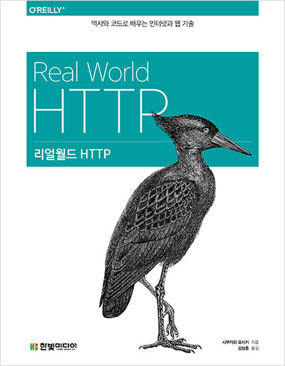

```
HTTP 공부 후 학습할 것
1. REST API 설계
2. high performance browser networking
```

HTTP는 지금은 인쇄하면 사전이 될 만큼 거대한 프로토콜(통신 규약)이다.
HTTP는 왜 지금의 모습이 됐는가?

HTTP를 데이터 상자로 생각하면, 몇 가지 요소로 나눌 수 있다.

1. 메서드와 경로
2. 헤더
3. 바디
4. 스테이터스 코드

HTTP를 다루는 도구로서 CURL 사용법을 알아두면 좋다.
CURL 커맨드를 사용하면 웹 API의 대화형 모드(REPL)처럼 서버의 동작을 검증하거나, 통신 프로토콜을 설명할 수 있다.

HTTP는 웹 브라우저와 웹 서버가 통신하는 절차와 형식을 규졍한 것
웹 브라우저로 웹페이지를 표시할 때 서버로부터 정보를 받아오는 약속이었으나,
현재는 번역 API나 데이터 저장 API등 다양한 서비스의 인터페이스로도 사용되고 있다.

HTTP의 역사

- 1990 : HTTP/0.9
  > 도큐먼트를 요청해서 가져오기만 하는 단순한 프로토콜
- 1996 : HTTP/1.0
- 1997 : HTTP/1.1
- 2005 : HTTP/2

##### 표 1-1 HTTP 프로토콜과 관련된 고유 명사

| 이름 | 정식명칭                          | 역할/의미                                           |
| ---- | --------------------------------- | --------------------------------------------------- |
| IETF | 인터넷 기술 태스크 포스           | 인터넷의 상호 접속성 향상 위한 임의 단체            |
| RFC  | Req 4 Comments                    | IETF가 만든 **규약 문서**                           |
| IANA | Internet Assigned Number Athority | 포트번호, 파일타입(Content-TYpe) 등 웹 DB 관리 단체 |
| W3C  | WWW consortium                    | 웹 표준화 비영리 단체                               |
